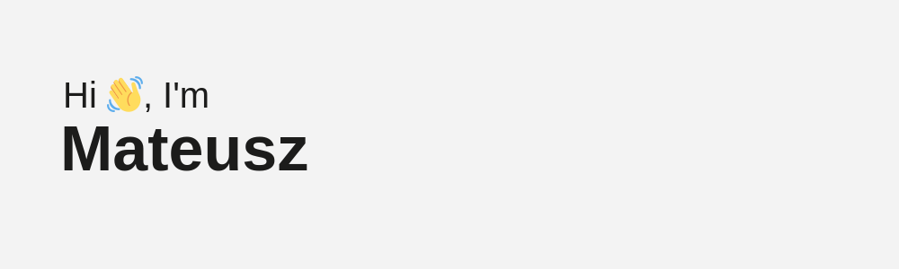

    
    <h2>I'm a Full-stack Software Developer!</h2>
    <ul>
        <li>🤓 I'm a very creative young programmer</li>
        <li>🏆 I'm not afraid of new challenges</li>
        <li>📚 I'm learning new things with pleasure</li>
        <li>💡 Currently I'm learning UX/UI design and React</li>
        <li>🚀 Hobby: science, astronomy and newest technology</li>
    </ul>
    <h2>Languages and tools:</h2>
    <h3>Backend:</h3>
    

        
        &nbsp;
        
        &nbsp;
        
        &nbsp;
        
    

    <h3>Frontend</h3>
    

        
        &nbsp;
        
        &nbsp;
        
    

    <h3>Tools</h3>
    

        
        &nbsp;
        
        &nbsp;
        
        &nbsp;
        
        &nbsp;
        
        &nbsp;
        
    

<h2>Contact me:</h2>

&nbsp;

&nbsp;

 
 
  
  

<h2>Stats:</h2>

    

